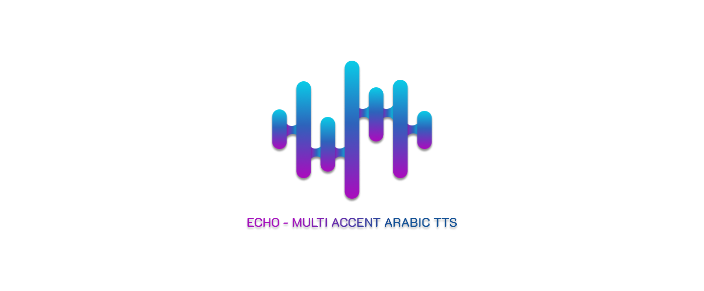

# ECHO-MultiAccentArabicTTS

ECHO is a Multi-Accent Fast API implementation delivers a versatile Text-to-Speech (TTS) solution using TenserFlowTTS as a base architecture for training on more than 50 hours of Egyptian &amp; Saudi Arabic Voice Annotated Data, focusing on being the most realistic voice generators in the MENA region.
